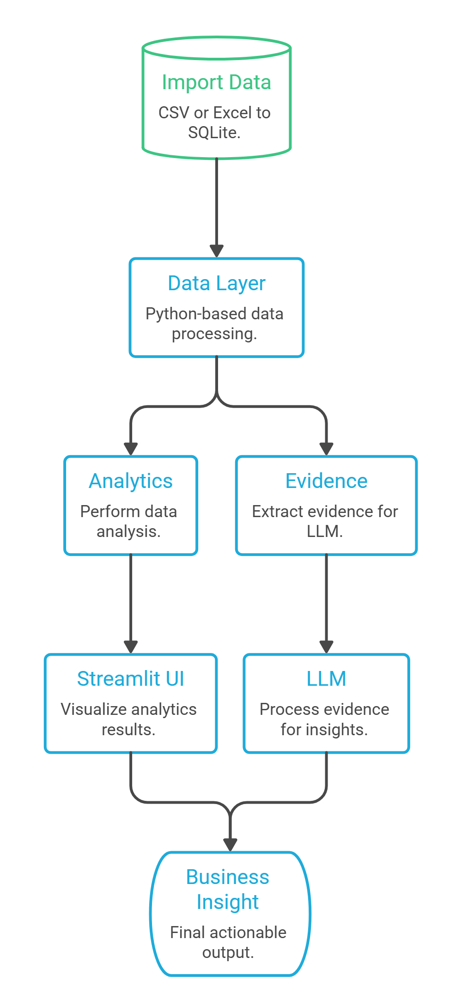

# Bangalore Market Intelligence Dashboard

This project is a decision-support dashboard built for Autopilot Offices. It helps the leadership team analyze commercial real estate data to determine where the company should expand next in Bangalore. The system turns raw, imperfect business data into actionable market intelligence, backed by real evidence.


## Demo: [https://marketinsightz.streamlit.app/]




### Key Features
- **Market Overview & Comparison**: Compare micro-markets across Bangalore using data like supply, vacancy, and average asking rent.
- **Market Opportunity Scoring**: Evaluate markets based on demand, economics, and competition.
- **Expansion Scenario Tool**: Enter specific budget and seating requirements to filter feasible expansion markets.
- **AI Market Analyst**: Ask questions in plain English. The AI fetches exact data from the database to answer without hallucinating.

### Tech Stack
- **Frontend**: Streamlit, Plotly
- **Database**: SQLite
- **AI/LLM**: OpenAI (Groq), Pandas

### How to Run Locally

1. Install dependencies using the provided `requirements.txt`:
   ```bash
   pip install -r requirements.txt
   ```
2. Create a `.env` file in the root directory and add your Groq API key:
   ```env
   GROQ_API_KEY=your_api_key_here
   ```
3. Initialize the database by running the seeder script:
   ```bash
   python database/seed_database.py
   ```
4. Start the Streamlit server:
   ```bash
   streamlit run app.py
   ```

### How to Deploy with Streamlit Community Cloud

1. Push this code to a public GitHub repository.
2. Go to [share.streamlit.io](https://share.streamlit.io/) and log in.
3. Click "New app", select your repository, and set the Main file path to `app.py`.
4. In the "Advanced settings" section, add your `GROQ_API_KEY` under the Secrets configuration.
5. Click "Deploy!"
